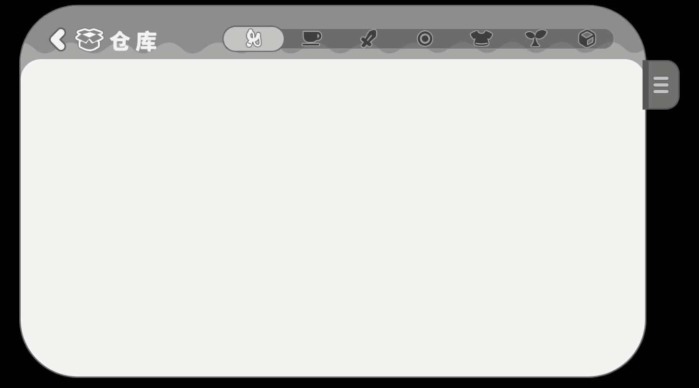

# GrayscaleGroup
Grayscale effect in unity like CanvasGroup

## Features
- Easy to use
- A lite API (field `GrayscaleInGroup` control all of child group)
- TextMeshProUGUI shader prepare to ready

## How to install
### Git Installation or Copy to project

## Usage
### How to enable Grayscale

```csharp
using UnityEngine;
using Binaryinject;

public class Test : MonoBehaviour
{
	[SerializeField] private GrayscaleGroup _group = null;
	
	private void Awake()
	{
		_group.GrayscaleInGroup = true;
	}
}
```



### How to use it in TextMeshProUGUI
1. Create duplicate material from font asset  

2. Rename `Material` suffix to Grayscale  

3. Change material shader to `TextMeshPro/Mobile/Distance Field - Grayscale`  

4. A list of changed font materials can now be displayed in the component inspector  

